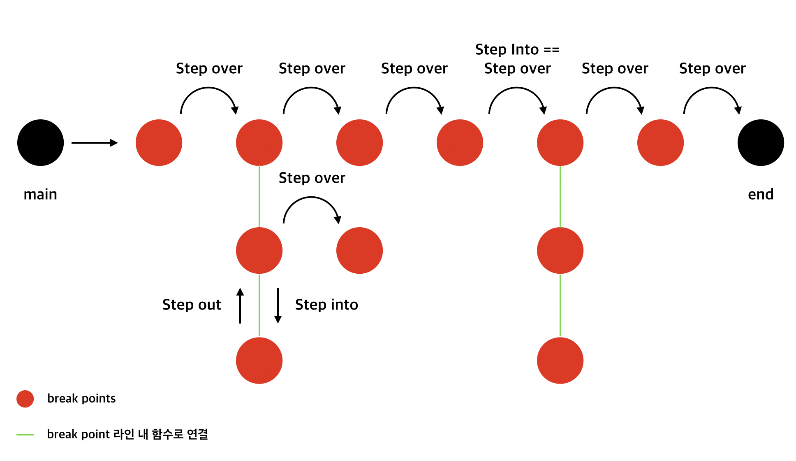

## NodeJS debugging in VSCode

[VScode 공식 홈페이지에서 Node.js 디버깅](https://code.visualstudio.com/docs/editor/debugging#nodejs-articles) 공부!

 

### Debug actions

- Continue / Pause F5
- Step Over `F10`
    - 지정된 라인을 넘어 디버거를 실행하는 작업. 라인이 함수를 포함하면 함수가 실행되고 각 라인을 디버깅하지 않고 결과가 반환된다.
- Step Into `F11`
    - 디버거를 사용하기 위한 작업. 라인이 함수를 포함하지 않을 경우 "Step Over"와 동일하게 동작하지만, 함수가 포함된 경우 디버거는 호출된 함수를 입력하고 거기서 라인별 디버깅을 계속한다.
    - 함수를 파고들며 어디서 문제가 발생하는 지 찾을 때 사용하면 유용할 것 같다.
- Step Out `⇧F11`
    - 현재 함수가 호출된 라인으로 돌아가는 디버거를 실행하는 동작
    - 디버깅 중인 함수 탈출
- Restart `⇧⌘F5`
- Stop `⇧F5`

 

### Break point 🔴

Break point는 중단점이라는 의미로, 코드 실행 도중 break point를 만나면 실행을 중단한다.

해당 라인에서 F9를 누르거나 라인 번호 왼쪽을 클릭해서 켜고 끌 수 있다.

**Contitional break point**

조건에 따라 코드 실행을 중단할지 말지를 결정할 수 있다. true / false를 사용할 수 있고 코드 내 변수를 활용할 수도 있다.🤭

 

### Log point

Logpoint는 코드 실행을 중단하지 않고 작성해둔 메시지를 console에 출력한다.

 

### Data inspection

VARIABLES 섹션에서 변수들을 검사할 수 있다. 변수값과 표현식값은 call stack 섹션에서 선택한 스택 프레임과 관련이 있다.

**Call stack**

- Call stack은 현재 어떤 함수가 동작하고 있는지, 그 함수 내에서 어떤 함수가 동작하는지, 다음에 어떤 함수가 호출되어야 하는지 등을 제어한다.
- 스크립트가 함수를 호출하면 인터프리터는 이를 콜스택에 추가한 다음 함수를 수행한다.
- 해당 함수에 의해 호출되는 모든 함수는 콜스택에 추가되고 call이 도달하는 위치에서 실행한다.
- 메인 함수가 끝나면 인터프리터는 스택을 제거하고 메인 코드 목록에서 중단된 실행을 다시 시작한다.
- 스택이 할당된 공간보다 많은 공간을 차지하면 ***stack overflow*** 에러가 발생한다.

WATCH 섹션의 + 버튼을 눌러 감시하고자 하는 변수 혹은 표현식을 감시할 수 있다.

 

### Debug Console REPL

Debug session 중에 Debug Console 창(⇧⌘Y)에서 Enter를 누르면 표현식을 입력할 수 있다. Shift + Enter를 누르면 여러 줄을 입력할 수 있다.

크롬 개발자 도구에서의 디버깅도 공부!

 

### 참고

- [Debugging in Visual Studio Code](https://code.visualstudio.com/docs/editor/debugging#_debug-actions)
- [VSCode - Variables reference](https://code.visualstudio.com/docs/editor/variables-reference)
- [Step Into Step-through Debugging](https://www.fourkitchens.com/blog/article/step-step-through-debugging/)