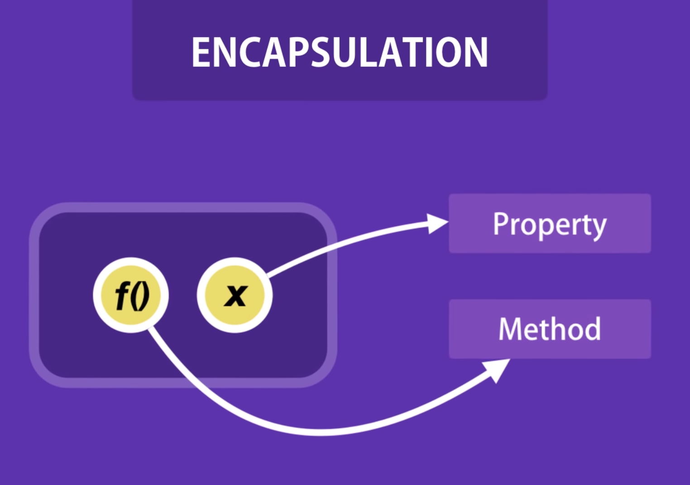
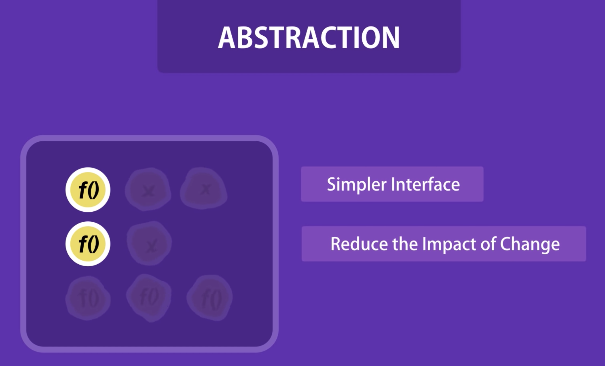

# OOP 개념 정리 (Class, 캡슐화, 추상화)

## Class

객체지향 프로그래밍(OOP)에서 클래스는 특정 종류의 객체에서 메서드들과 변수들의 `템플릿 정의`이다. 따라서 객체는 클래스의 인스턴스로서 변수 대신 실제 값을 가지고 있다. (instance의 사전적 의미 = 사례, ~을 예로 들다.)

클래스는 객체지향 프로그래밍에서 무언가를 정의하는 아이디어 중 하나이다. 아래는 클래스에 대한 중요한 아이디어들이다.

- 클래스는 해당 클래스의 특성 중 일부 혹은 전부를 상속할 수 있는 subclass를 가질 수 있다. 각 subclass들 입장에서 클래스는 superclass가 된다.
- subclass들은 superclass에 정의되어 있지 않은 메서드나 변수를 따로 정의할 수 있다.
- 클래스의 구조와 해당 클래스의 subclass를 묶어서 class hierarchy(클래스 계층?)라고 부른다.

또, 클래스는 객체(object)를 만들기 위한 청사진(blueprint)이라고도 말할 수 있다. 상태(state)를 위해 초기 값을 제공하고, 행동을 실행한다.

여기서 상태는 멤버 변수, 행동은 메서드로 볼 수 있다.

instance라는 개념은 특정 클래스로부터 생성된 특정 객체를 의미한다.

<br>

### Class in javascript

자바스크립트에서 class 키워드는 ES2016(ES6)에 등장했다. 기존에 자바스크립트는 프로토타입 기반의 상속을 사용했고, class를 사용하면 좀 더 명료하게 사용할 수 있게 되었다.

class 키워드가 새로운 객체지향 상속 모델을 제공하는 것은 아니다.

자바스크립트의 클래스는 사실 함수이다. 자바스크립트에서 함수를 함수 표현식과 함수 선언문으로 작성할 수 있듯이, 클래스에도 클래스 표현식, 클래스 선언문 클래스를 생성할 두 가지 방법이 존재한다.

**Class declarations(클래스 선언문)**

class 키워드를 사용하여 클래스를 선언할 수 있다.

```js
//class 선언문
class Ball {
  constructor(name, radius) {
    this.name = name;
    this.radius = radius;
  }
}
```

- 함수 선언문과 클래스 선언문의 차이

  함수 선언문과 클래스 선언문의 큰 차이점은 `호이스팅`에 있다. 함수 선언문으로 작성한 함수는 호이스팅 되지만 클래스 선언문으로 선언된 클래스는 호이스팅 되지 않는다. 따라서 클래스를 사용하거나 접근하기 위해서는 먼저 클래스가 위에서 선언되어 있어야 한다.

**Class expression(클래스 표현식)**

class 표현식은 이름을 표기해도 되고 표기하지 않아도 가능하다. 클래스에 이름을 명시해주지 않으면 클래스를 저장한 변수명이 해당 클래스의 name 프로퍼티로 지정되고, 이름을 명시하면 클래스를 저장한 변수에 관계없이 클래스의 이름이 name 프로퍼티로 지정된다.

```js
//class 표현식
//unnamed
const ball = class {
  constructor(name, radius) {
    this.name = name;
    this.radius = radius;
  }
};
console.log(ball.name); //ball

//named
const anotherBall = class MyBall {
  constructor(name, radius) {
    this.name = name;
    this.radius = radius;
  }
};
console.log(anotherBall.name); //MyBall
```

### **참고**

- [WhatIs.com - class](https://whatis.techtarget.com/definition/class)
- [Brilliant.org - Classes(OOP)](https://brilliant.org/wiki/classes-oop/)
- [MDN web docs - Classes](https://developer.mozilla.org/en-US/docs/Web/JavaScript/Reference/Classes)

---

<br>

## 캡슐화 (Encapsulation)

캡슐화는 객체지향 프로그래밍의 기본적인 개념 중 하나이다. 캡슐화는 클래스 같은 한 단위 내에서 해당 데이터에 대해 작동하는 데이터와 메소드를 번들링(캡슐화) 한다는 개념이다.


이미지 출처 : https://www.youtube.com/watch?v=pTB0EiLXUC8

간단히 말하면, 관련 있는 데이터(변수)와 메소드를 묶는 것(grouping)을 캡슐화라고 한다.

예시를 통해 캡슐화를 살펴보자.

```js
let baseSalary = 20000;
let overtime = 10;
let rate = 20;

function getWage(baseSalary, overtime, rate) {
  return baseSalary + overtime * rate;
}

//위 코드에 대해 캡슐화
const employee = {
  baseSalary: 20000,
  overtime: 10,
  rate: 20,
  getWage: function() {
    return this.baseSalary + this.overtime * this.rate;
  }
};
```

캡슐화를 통해 변경된 점으로는 getWage()에 파라미터가 사라졌다는 점이다. 캡슐화를 통해 해당 객체에 모든 정보가 있으니, 파라미터가 필요 없어진 것이다.

파라미터가 많은 함수는 재사용성과 유지보수면에서 떨어진다는 단점이 있다.

### 참고

- [Stackify - OOP Concept for Beginners: What is Encapsulation](https://stackify.com/oop-concept-for-beginners-what-is-encapsulation/)
- [Youtube - Object-oriented Programming in 7 minutes | Mosh](https://www.youtube.com/watch?v=pTB0EiLXUC8)

---

<br>

## 추상화 (abstraction)

추상화를 하는 이유는 `불필요한 세부사항을 사용자로부터 숨김으로써 복잡성을 처리하기 위함`이다.

추상화는 사용자가 모든 숨겨진 복잡성을 이해하거나 생각하지 않고도 제공된 추상화 위에 더 복잡한 논리를 구현할 수 있게 해준다.


이미지 출처 : https://www.youtube.com/watch?v=pTB0EiLXUC8

추상화 개념 이해를 위해 DVD player에 대해 생각해보자.

우리는 DVD player를 리모콘에 있는 몇개의 버튼만으로 조작한다. 하지만 이 DVD player 내부적으로 어떻게 DVD를 재생 시키거나 멈추거나 볼륨을 높이는지 등에 대해선 알지 못해도 잘 실행된다.

사용자가 굳이 알 필요 없는 복잡함을 숨겼다는 점에서 추상화의 예시로 들 수 있다.

객체를 추상화함으로써 얻는 이점 들에 다음과 같은 것들이 있을 수 있다.

- 좀 더 단순한 인터페이스
- 변경사항 발생 시 영향을 줄일 수 있다.

### 참고

- [Stackify - OOP Concept for Beginners: What is Abstraction?](https://stackify.com/oop-concept-abstraction/)
- [Youtube - Object-oriented Programming in 7 minutes | Mosh](https://www.youtube.com/watch?v=pTB0EiLXUC8)

---

<br>

## **객체 지향 프로그래밍을 공부하며 느낀 점?**

객체지향 프로그래밍의 개념들을 공부해 보니 사람이 더 쉽게 이해할 수 있도록 코드를 작성하는 하나의 디자인 방법론이라는 점이 느껴졌다.

객체, 클래스, 추상화 등의 개념들을 현실 세계에 빗댈 수 있었고 그랬을 때 좀 더 와닿는 설명이 되었다.

자바스크립트에서 객체, 그리고 클래스를 공부하고 활용하면서 사실 객체 지향 프로그래밍의 장점을 생각하며 그 장점을 최대한 이용하려고 생각하며 코딩을 하진 않았던 것 같다.

코드를 설계하는 단계에서 내가 해결하고자 하는 문제가 무엇이며, 그 문제를 해결하는 방식을 어떻게 할 것인지에 대해 더 고민하고 생각 해야겠다. 그럼 객체 지향적으로 설계를 해야 하는지 아니면 또 다른 방법을 사용해야 하는지 결정하기가 더 수월할 것 같다.
